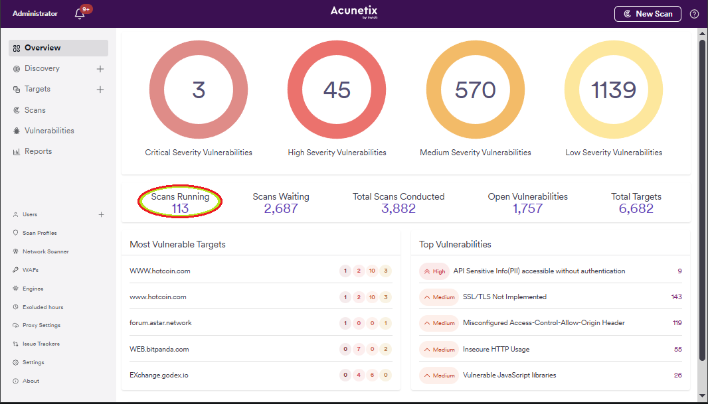
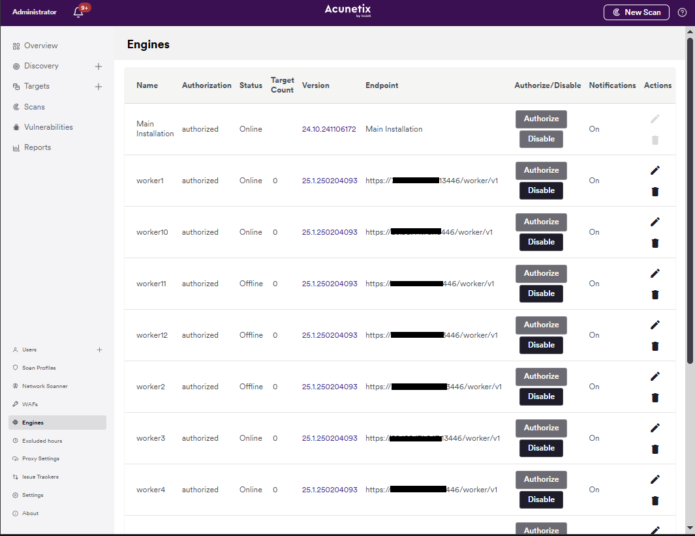
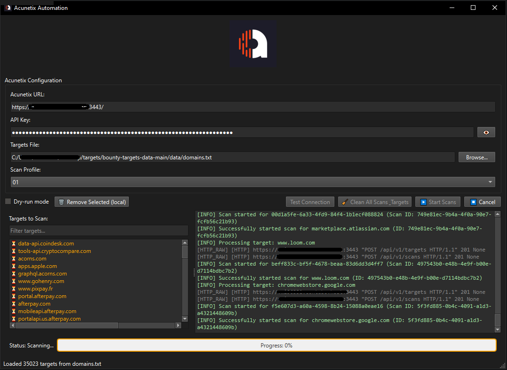

# Acunetix Bulk Manager — Automate, Clean & Scale Scans for 10K+ Targets

> **A powerful PyQt6 GUI for bulk managing Acunetix scans — add 10,000+ targets instantly, cancel/delete all scans in one click, and monitor HTTP traffic in real time. Built for DevSecOps teams managing large-scale infrastructure. No more manual clicks. Just automation.**


---

## 📸 Screenshots

### 1. Main Interface — Add 10K+ Targets & Start Scans Immediately
  
*Browse targets, test connection, select profile, and start scans in one click — no scheduling, no delays.*

### 2. Clean All Scans & Targets — Safe Bulk Deletion with Confirmation
  
*Delete all targets and/or scans with a single click — requires typing `yes` to confirm. No accidental deletions.*

### 3. Real-Time HTTP Logging — Debug API Calls Live
  
*See every HTTP request and response in real time — perfect for troubleshooting API issues or validating payloads.*

---

## ⚙️ Features

- ✅ **Add 10,000+ targets** from a text file — no pagination limits, no UI freeze.
- ⚡ **Start scans immediately** on target addition — no scheduling delays.
- 🧹 **One-click "Clean All Scans & Targets"** with confirmation dialog (type `yes` to confirm).
- 🔍 **Real-time HTTP request/response logging** in a dedicated tab — no more generic logs.
- 🧩 **Filter & remove targets** from the list with live search and multi-select.
- 🔐 **API key securely stored** in system keyring (no plaintext configs).
- 🌐 **Test connection** with profile auto-detection and error handling.
- 📊 **Progress bar + status indicator** for long-running operations.
- 🛑 **Safe cleanup** — aborts active scans before deleting targets.
- 💻 **Lightweight, cross-platform** PyQt6 GUI — runs on Windows, Linux, macOS.
- 🧪 **Dry-run mode** — test your workflow without touching live targets.
- 🖥️ **Compact, efficient UI** — no unnecessary tabs (e.g., no “Technical Log” clutter).

---

## ⚙️ Requirements

- Python 3.8+
- `requests`, `keyring`, `PyQt6`, `urllib3`
- Acunetix v13+ with API access enabled

Install dependencies:
```bash
pip install requests keyring PyQt6 urllib3